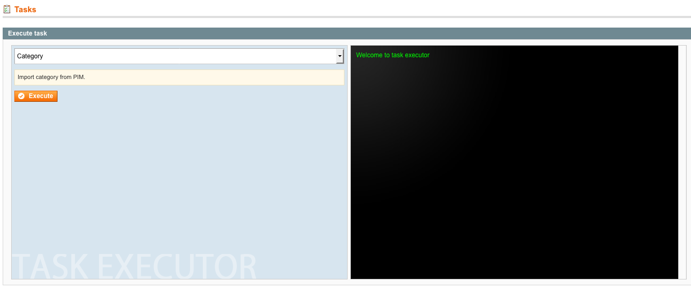

# PIMGento (API) Interface

### Locate and use the interface:

* PIMGento (API) Import Interface is located at PIMGento > Imports

* Select your import type from the list
* ***Import*** launch the import

* Once you launch your import you can follow the import progress with the console.
>  DO NOT CLOSE THE BROWSER WINDOW WHILE THE IMPORT IS STILL ON !
* If an error appears, you can easily identify at which task the problem occurred. You can check your logs files if you want further informations.