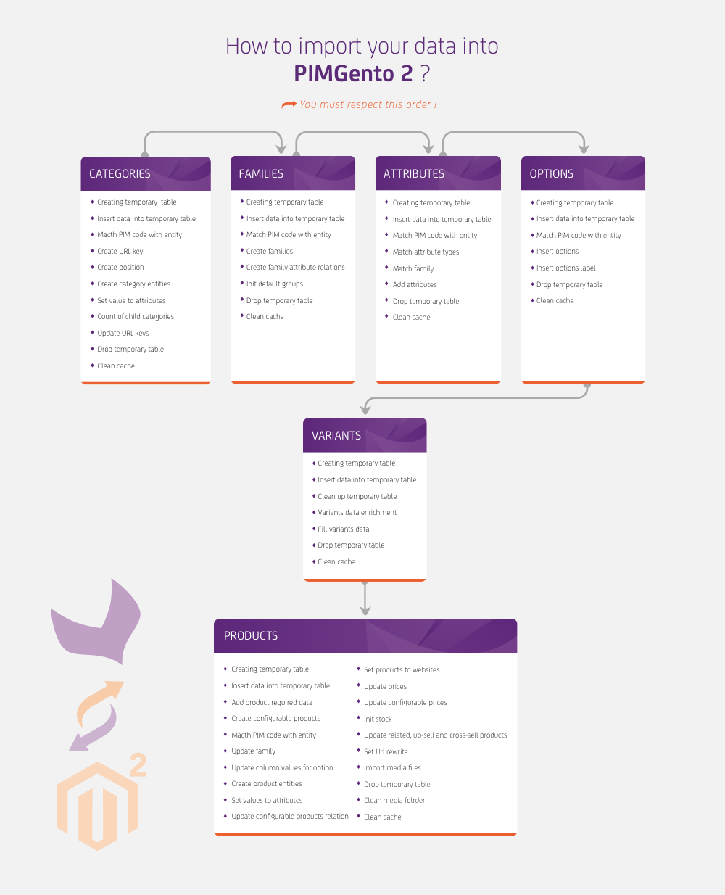

# Import

### Import Order:

In order to prevent errors due to missing data in Magento 2, you need to launch the jobs in a specific order.

The following diagram is pretty straightforward for importing your data in order with PIMGento2 (API). 
You can skip steps, but be careful ! For example, if you want to import attribute options and you have newly created attributes, if you don't import them before (even if you don't want to import this options for those missing attributes) it will result in an error. So check your data before importing it !

### Media import

The media files are imported during the simple product import process.
You can configure the columns to use in the Magento Catalog > Pimgento configuration section.

### About the import :

PIMGento2 (API) insert all the data into a temporary table. Then data manipulation (mapping,...) is made within this temporary table in SQL. Finally modified content is directly inserted in SQL in Magento 2 tables.

Even if raw SQL insertion is not the way you usually used to import data into a system, it is way more faster than anything else for the moment, especially with the volume of data you can have with a full Akeneo catalog. It results in a significant time saving in your import.